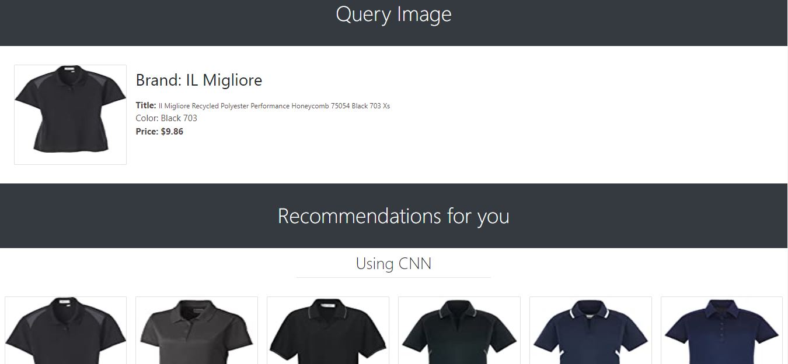

# Amazon Fashion Recommendation Engine using Django3
> Recommendation of fashion clothes using TFIDF, BOW and CNN. In tfidf and bow I have taken the euclidean distance between the brand name, color, price of query image and all the reamaining images. In CNN based model I have extracted all the features using VGG16 architecture and get the euclidean distance between query image and all the images.

## Requirements  (Prerequisites)
* Linux or Windows
* Python 3.8 and up

For Windows

`git clone https://github.com/shubendu/Amazon_fashion_recommendation_engine.git`

## Install project dependencies:

`$ pip install -r requirements.txt`

Then simply apply the migrations:

    $ python manage.py migrate
    

You can now run the development server:

    $ python manage.py runserver

 
## Demo
For live demo click [here](https://vast-meadow-34038.herokuapp.com/)

## Tech Stack / Built With
1. Django3 - The python framework
2. Bootstrap4 
3. Heroku (for deployment)

  
## Authors

- [@shubendu](https://www.github.com/shubendu)

  
## 🔗 Links

  